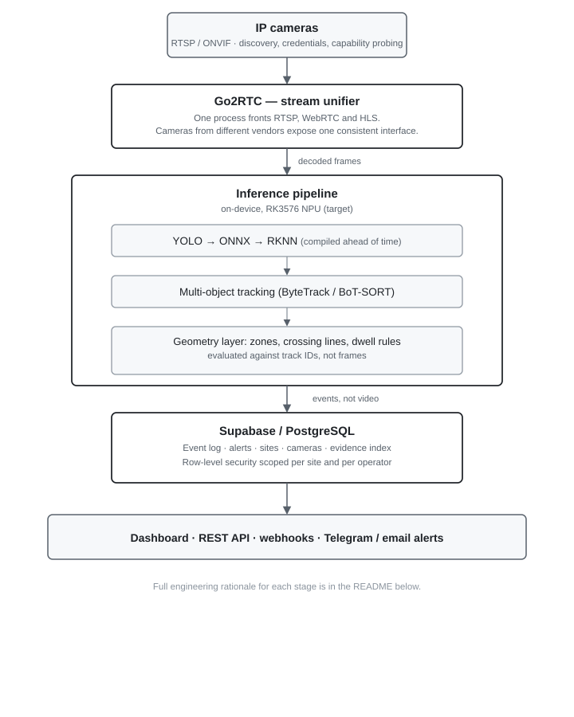

# Edge AI Surveillance — Embedded Computer Vision Pipeline


**Commercial-grade edge video analytics appliance for public tenders. IP cameras in, structured events out — all inference on-device, no video leaving the site unless an operator asks for it.**

> **This repository documents the architecture. The implementation is private** — it is the product being commercialised. What follows is the design, the engineering decisions and the measured targets, at the level of detail a technical reader needs to evaluate the work.

---

## Current vs. target

**Current — validated and running:** a multi-camera prototype on x86/Windows, tested against live RTSP streams. Go2RTC unifies the camera feeds, OpenCV/YOLO does the detection, and the Supabase backend already implements the tenant-isolated event pipeline described below. 317 automated tests, CI on every push.

**Target — the deployment this is built toward:** the same pipeline compiled to RKNN and running on-device on an RK3576 NPU appliance, at the throughput and latency figures in the Targets table below. That migration is the hardware-specific work still ahead — the software architecture (events not video, tracking before rules, tenant isolation) does not change.

The distinction matters: everything under **Architecture**, **Engineering decisions** and the Supabase backend is real, tested code today. Everything under **Targets** is where that code is headed on dedicated hardware, not yet measured on it.

---

## The constraint that shapes everything

Public-sector video surveillance has two requirements that pull against each other: **operators need real-time detection across many cameras**, and **footage cannot be shipped to a cloud provider for analysis**. Bandwidth at remote sites makes it impractical; procurement rules often make it impossible.

That forces inference to the edge, onto hardware with a fixed power and thermal budget. Every decision below follows from it.

---

## Architecture

<picture>
  <source media="(prefers-color-scheme: dark)" srcset="./docs/architecture-dark.svg">
  
</picture>

<details>
<summary>Text version of the diagram</summary>

```
IP cameras (RTSP / ONVIF)
        │  discovery, credentials, capability probing
        ▼
Go2RTC — stream unifier
  One process fronts RTSP, WebRTC and HLS. Cameras from
  different vendors expose one consistent interface.
        │  decoded frames
        ▼
Inference pipeline (on-device, RK3576 NPU — target)
  YOLO → ONNX → RKNN (compiled ahead of time)
        │
        ▼
  Multi-object tracking (ByteTrack / BoT-SORT)
        │
        ▼
  Geometry layer: zones of interest, crossing lines,
  dwell rules — evaluated against track IDs, not frames
        │  events, not video
        ▼
Supabase / PostgreSQL
  Event log · alerts · sites · cameras · evidence index
  Row-level security scoped per site and per operator
        │
        ▼
  Dashboard · REST API · webhooks · Telegram / email alerts
```

</details>

---

## Hardware

| | |
|---|---|
| **Board** | NanoPi M5 — Rockchip RK3576 |
| **Compute** | 4× Cortex-A55 + NPU rated at 6 TOPS |
| **Memory** | 4 GB LPDDR4 |
| **OS** | Linux ARM64 (Ubuntu 22.04 / Armbian) |
| **Deployment** | Docker Compose, reproducible build, field-updatable over the air |

The NPU is the reason this board was chosen and the reason the software looks the way it does. CPU-only inference on an A55 cluster does not sustain four streams; the NPU does, but only for models compiled to its own runtime.

---

## Engineering decisions

**RKNN over ONNX Runtime.** ONNX Runtime is easier to work with and runs the same model on any machine — but on this board it falls back to CPU and the frame budget collapses. Compiling YOLO through `ONNX → RKNN Toolkit v2` binds the project to Rockchip hardware in exchange for the NPU. For a fixed-hardware appliance that trade is worth taking; for portable software it would not be.

**Go2RTC as the stream unifier.** IP cameras disagree about everything: transport, authentication, codec, keyframe interval. Putting one proxy in front means the inference pipeline consumes a single interface and camera compatibility becomes a configuration problem rather than a code problem. It also gives WebRTC to the dashboard without a second transcoding path.

**Events cross the network, video does not.** Detection produces structured events; clips are stored locally and uploaded only on demand, bounded to a short window around the event. This keeps bandwidth predictable at remote sites and narrows what is exposed if the backend is compromised.

**Tracking before rules, not after.** Zone and line-crossing logic is evaluated against track identities rather than per-frame detections. A person standing on a boundary generates one event, not forty — which is the difference between an alerting system an operator trusts and one they mute.

**Backend patterns reused, not reinvented.** Multi-site isolation, row-level security and provisioning follow the same model already running in production on [NUMEN AI](https://github.com/lindermannn/numen-platform). Two products, one tenancy model.

---

## Targets

These are design targets for the pilot, not yet-measured results — see [BENCHMARKS.md](./BENCHMARKS.md) for what the automated evaluation harness actually checks today and what's still pending a real 24h run.

| Metric | Target |
|---|---|
| Glass-to-glass latency (camera → alert) | < 200 ms |
| Throughput | 4 concurrent streams at 15+ FPS each |
| Sustained NPU utilisation | < 80 % |
| Uptime | 99.9 % (watchdog + auto-restart) |
| Storage | Events in Postgres; video on demand only, 10 s pre/post event |

---

## Status and roadmap

**Validated prototype, pre-hardware-migration.** Pipeline working and validated against live RTSP streams on x86/Windows (see *Current vs. target* above). RK3576 hardware defined; NPU migration and commercial pilot in preparation.

| Phase | Objective |
|---|---|
| M1 | Hardware and OS baseline; Go2RTC fronting four cameras |
| M2 | YOLO → RKNN on NPU; detection and tracking above 15 FPS |
| M3 | Event ingestion into Supabase; schema, RLS, basic alerting |
| M4 | Multi-site and multi-tenant: sites, cameras, roles, API keys |
| M5 | Web dashboard with live streams and camera map |
| M6 | Commercial pilot — one real site, 2–4 weeks, measured |
| M7 | Hardening: watchdogs, OTA updates, NPU metrics |
| M8 | Tender documentation package |
| M9 | Go-to-market: portable demo, pricing, partners |

---

## Stack

| Layer | Technology |
|---|---|
| **Hardware** | NanoPi M5, Rockchip RK3576 (NPU) |
| **OS** | Linux ARM64 |
| **Streaming** | Go2RTC, RTSP, ONVIF, WebRTC, HLS |
| **Inference** | YOLO → ONNX → RKNN Toolkit v2 |
| **Tracking** | ByteTrack / BoT-SORT |
| **Backend** | Supabase (PostgreSQL, Realtime, Auth, RLS) |
| **Languages** | Python (pipeline, API), C++ (RKNN runtime), SQL |
| **Packaging** | Docker / Docker Compose, reproducible builds, OTA |

---

## What is not here

The source, the RKNN compilation pipeline, the tender documentation and the deployment configuration live in a private repository. This one exists so the architecture can be reviewed without publishing the product.

Happy to walk through the implementation in a technical conversation.

---

**Dimitry Donaire** — Applied AI Engineer
[github.com/lindermannn](https://github.com/lindermannn) · [numen-ai.cl](https://numen-ai.cl)
